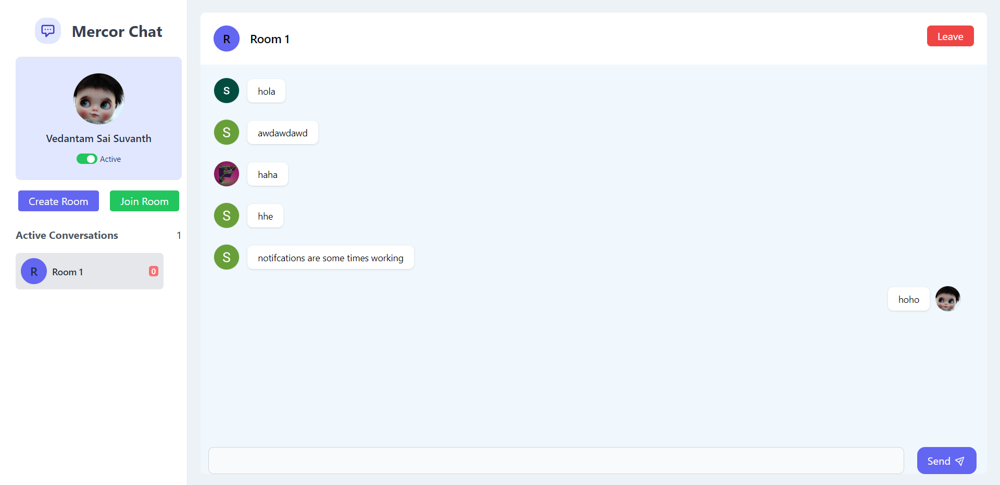

# Real-Time Chat Application

This is a real-time chat application built using the MERN stack and Socket.IO for real-time communication. The application allows users to join different chat rooms and exchange messages with other users in real-time.

Live Demo: https://mercor-539f2.web.app/

## Features

- User authentication: Users can sign up and log in to the application.
- Chat rooms: Users can join different chat rooms and participate in multiple conversations simultaneously.
- Real-time messaging: Messages are sent and received in real-time using Socket.IO.
- Message history: Users can view previous messages in a chat room.
- User online status: Users can see the online status of other users in the chat room.

## Technologies Used

- MongoDB: Database to store user information and chat messages.
- Express.js: Backend framework to handle HTTP requests and API routes.
- React: Frontend library for building the user interface.
- Node.js: Server-side JavaScript runtime environment.
- Socket.IO: Library for real-time bidirectional communication between clients and servers.
- Vite: Build tool for the frontend development setup.

## Getting Started

### Prerequisites

- Node.js: Make sure Node.js is installed on your system. You can download it from the official website: https://nodejs.org

### Installation

1. Clone the repository:

   ```shell
   git clone https://github.com/saisuvanth/mercor-chat.git
   ```

2. Change to the project directory:

   ```shell
   cd mercor-chat
   ```

3. Install the backend dependencies:

   ```shell
   cd server
   yarn
   ```

4. Install the frontend dependencies:

   ```shell
   cd app
   yarn
   ```

5. Configure environment variables:
   - Rename the `.env.example` file in the `server` directory to `.env`.
   - Update the values in the `.env` file with your MongoDB connection URL and any other required configurations.
   - Register you firebase application and update the values in the `.env` file with your firebase configurations.

6. Start the backend server:

   ```shell
   cd server
   yarn dev
   ```

7. Start the frontend development server:

   ```shell
   cd app
   yarn dev
   ```

8. Open your web browser and access the application at `http://localhost:3000`.

## Usage

1. Sign up for a new account or log in to an existing account.
2. Join a chat room by entering the room name.
3. Start sending and receiving messages in real-time with other users in the same room.
4. To join another room, simply navigate to the home page and repeat step 2.

